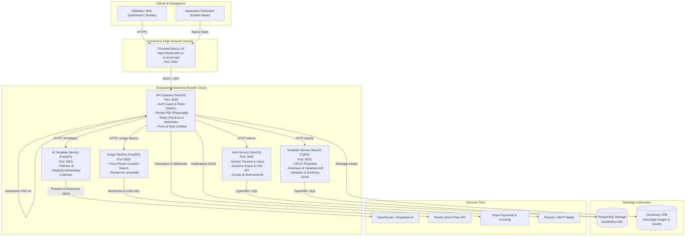
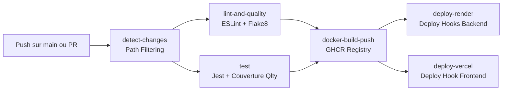

# BuildWithUs — BuildWithUse Template Builder

<div align="center">


[](https://build-with-us-xi.vercel.app)
[](https://github.com/mohamedazizsaid/BuildWithUS)
[](#)

<p align="center">
  <strong>Plateforme SaaS tout-en-un de conception, gestion et automatisation de templates d'entreprise (Email, Factures, Contrats, SMS, WhatsApp, RCS) assistée par Intelligence Artificielle générative, dotée d'une architecture Microservices hautement disponible, découplée et pilotée par les événements.</strong>
</p>

🌐 **Lien de Production :** [https://build-with-us-xi.vercel.app](https://build-with-us-xi.vercel.app)

</div>

---

### 🚀 Stack Technologique Principale

| Domaine | Technologies |
| :--- | :--- |
| **Frontend** | **Next.js 16** (App Router), **React 19**, **TypeScript 5.9+**, **TailwindCSS v4**, **Radix UI**, **Tiptap**, **Framer Motion**, **Dnd-Kit**, **Vercel AI SDK** |
| **Backend & Passerelle** | **NestJS 11**, **Node.js 20 LTS**, **Express**, **Playwright Chromium** (moteur de conversion PDF A4), **TypeORM 0.3+** |
| **Services IA & Data** | **Python 3.11**, **FastAPI**, **DeepSeek v3.2** (via OpenRouter), **Pexels API**, **Sentence-Transformers** (CLIP multilingue), **ChromaDB** |
| **Bases de Données & Stockage**| **PostgreSQL** (Multi-tenant partitionné), **Cloudinary** (Gestion de médias CDN), **MinIO / S3** |
| **DevOps & CI/CD** | **Docker Multi-Stage**, **GitHub Actions**, **GHCR (GitHub Packages)**, **Render Blueprint (IaC)**, **Vercel Edge** |

---

## 📑 Table des Matières

- [1. Présentation Générale](#1-présentation-générale)
- [2. Fonctionnalités Clés du Système](#2-fonctionnalités-clés-du-système)
- [3. Architecture Globale des Microservices](#3-architecture-globale-des-microservices)
  - [3.1 Cartographie des Services et Ports](#31-cartographie-des-services-et-ports)
  - [3.2 Diagramme d'Architecture et d'Échanges](#32-diagramme-darchitecture-et-déchanges)
  - [3.3 Conception DDD (Domain-Driven Design) & CQRS](#33-conception-ddd-domain-driven-design--cqrs)
- [4. Détail des Modules Applicatifs](#4-détail-des-modules-applicatifs)
  - [4.1 Frontend (`/frontend`)](#41-frontend-frontend)
  - [4.2 API Gateway (`/api-gateway`)](#42-api-gateway-api-gateway)
  - [4.3 Auth Service (`/auth-service`)](#43-auth-service-auth-service)
  - [4.4 Template Service (`/template-service`)](#44-template-service-template-service)
  - [4.5 AI Template Service (`/ai-template-service`)](#45-ai-template-service-ai-template-service)
  - [4.6 Image Pipeline (`/image-pipeline`)](#46-image-pipeline-image-pipeline)
  - [4.7 Shared Kernel & Contrats Proto (`/packages`)](#47-shared-kernel--contrats-proto-packages)
- [5. Guide Complet des Variables d'Environnement](#5-guide-complet-des-variables-denvironnement)
- [6. Installation et Démarrage en Local](#6-installation-et-démarrage-en-local)
  - [6.1 Prérequis Système](#61-prérequis-système)
  - [6.2 Compilation des Packages Partagés](#62-compilation-des-packages-partagés)
  - [6.3 Lancement Global Automatisé (Scripts)](#63-lancement-global-automatisé-scripts)
  - [6.4 Lancement Individuel par Service](#64-lancement-individuel-par-service)
- [7. Conteneurisation Docker](#7-conteneurisation-docker)
- [8. Pipeline CI/CD (GitHub Actions)](#8-pipeline-cicd-github-actions)
  - [8.1 Déclencheurs et Stratégie](#81-déclencheurs-et-stratégie)
  - [8.2 Matrice des Jobs](#82-matrice-des-jobs)
  - [8.3 Secrets GitHub Requis](#83-secrets-github-requis)
- [9. Déploiement et Hébergement en Production](#9-déploiement-et-hébergement-en-production)
  - [9.1 Déploiement Frontend sur Vercel](#91-déploiement-frontend-sur-vercel)
  - [9.2 Déploiement Backend sur Render (Blueprint IaC)](#92-déploiement-backend-sur-render-blueprint-iac)
- [10. Système de Tarification et Facturation Stripe](#10-système-de-tarification-et-facturation-stripe)
- [11. Sécurité et Bonnes Pratiques](#11-sécurité-et-bonnes-pratiques)

---

## 1. Présentation Générale

**BuildWithUs** est une solution SaaS de niveau entreprise conçue pour révolutionner la production de supports transactionnels et marketing. La plateforme combine :
1. Un studio visuel de composition riche (No-Code / Low-Code).
2. Des modèles d'IA générative pour générer du contenu, suggérer des palettes graphiques harmonieuses et mapper automatiquement des jeux de données volumineux (CSV, Excel) vers les variables de templates.
3. Une architecture microservices hautement résiliente, scalable et strictement cloisonnée pour assurer la confidentialité totale des données clients (Multi-Tenancy).

L'application est déployée en production et accessible publiquement :
👉 **[Accéder à l'application BuildWithUs en Production](https://build-with-us-xi.vercel.app)**

---

## 2. Fonctionnalités Clés du Système

- **Studio Visuel de Création Multi-Canal :**
  - **Emails responsive :** Moteur MJML et HTML avec rendu dynamique multi-clients.
  - **Documents légaux & Facturation :** Moteur paginé A4 (contrats, devis, factures) avec gestion des en-têtes, pieds de page, pagination dynamique et conversion PDF via Chromium headless.
  - **Canaux instantanés :** SMS, WhatsApp Business API et RCS avec aperçu instantané sur mockup mobile.
- **Assistance et Automatisation IA :**
  - Assistant de génération et de retouche de sections propulsé par **DeepSeek v3.2** via OpenRouter.
  - Recommandation intelligente de palettes de couleurs selon le type d'email et l'ambiance désirée.
  - **Smart Mapping de variables :** Détection sémantique et correspondance assistée par IA entre les colonnes de fichiers tableurs (Excel/CSV) et les variables du template (`{{nom}}`, `{{montant_ht}}`, etc.).
- **Banque de Médias Intégrée :**
  - Recherche et intégration instantanée de photographies haute définition via le proxy CDN **Pexels**.
  - Pipeline optionnel d'indexation vectorielle locale avec embeddings CLIP multilingues et base vectorielle **ChromaDB**.
- **Mode Iframe / Embeddable Builder :**
  - Intégration transparente du studio dans des applications partenaires ou CRM tiers via des sessions éphémères signées (`builder_sessions`) et des tokens d'accès uniques.
- **Espace Développeur & API Publique :**
  - Gestion des clés d'API sécurisées (`client_id`, `client_secret_hash`), permissions granulaires par scopes, webhooks et documentation interactive.
- **Gestion Multi-Tenant & Rôles Granulaires (RBAC) :**
  - Isolation stricte des données au niveau de la persistance par `tenant_id`.
  - Hiérarchie de permissions : `superadmin`, `admin`, `editor`, `marketing`, `viewer`.
- **Facturation et Monétisation Stripe Complète :**
  - Plans d'abonnement (Gratuit, Pro, Pro Entreprise, Compte Interne).
  - Gestion des cycles Mensuel et Annuel (avec réduction engagement 1 an).
  - Prise en charge de la TVA dynamique (Stripe Tax Rate 20% France).
  - Portail client Stripe self-service et webhooks de synchronisation d'état automatisés.

---

## 3. Architecture Globale des Microservices

Le système s'articule autour d'une passerelle centrale (**API Gateway**) qui expose des routes REST unifiées aux clients (Frontend web, SDK, Iframe partenaires), tout en relayant les opérations métier vers des microservices spécialisés.

### 3.1 Cartographie des Services et Ports

| Service | Emplacement | Environnement & Runtime | Port Local | Port Production (Render/Vercel) | Rôle & Responsabilités |
| :--- | :--- | :--- | :---: | :---: | :--- |
| **Frontend** | `/frontend` | Next.js 16, React 19, Node 20 | `3001` | Cloud Vercel | Interface web, Studio drag-and-drop, Dashboard client, Portail de gestion |
| **API Gateway** | `/api-gateway` | NestJS 11, Express, Node 20 | `3000` | Render (HTTP) | Point d'entrée unique, Auth Guard, RBAC, Playwright PDF renderer, Billing Stripe |
| **Auth Service** | `/auth-service` | NestJS 11, TypeORM, PostgreSQL | `3003` | Render (HTTP) | Gestion des comptes, tenants, utilisateurs, sessions embed, clés API tierces |
| **Template Service** | `/template-service`| NestJS 11, TypeORM, CQRS | `3002` | Render (HTTP) | Moteur de persistance des templates, versions, variantes, variables, soft delete |
| **AI Template Service**| `/ai-template-service` | Python 3.11, FastAPI, Uvicorn | `8001` | Render (HTTP) | Recommandation de palettes chromatiques et mapping sémantique de variables |
| **Image Pipeline** | `/image-pipeline` | Python 3.11, FastAPI, Uvicorn | `8002` | Render (HTTP) | Proxy CDN Pexels, vector search ChromaDB, téléchargement et pipeline d'ingestion |
| **Shared Kernel** | `/packages/shared-kernel` | TypeScript (Node Package) | *N/A* | Inclus dans images | Noyau partagé DDD : Value Objects, AggregateRoot, Intercepteurs, Logger |
| **Proto Packages** | `/packages/proto` | Protobuf definitions | *N/A* | Inclus dans images | Schémas de contrats gRPC (`template_commands.proto`, `template_queries.proto`) |

---

### 3.2 Diagramme d'Architecture et d'Échanges



---

### 3.3 Conception DDD (Domain-Driven Design) & CQRS

Les services centraux (`template-service` et `auth-service`) appliquent les principes de l'architecture hexagonale (Clean Architecture) et du Domain-Driven Design (DDD) :

```
src/templates/
├── domain/                      # Cœur métier pur (aucun framework, règles d'entreprise)
│   ├── aggregate/               # Agrégat Template
│   ├── entities/                # Entités du domaine
│   ├── events/                  # Événements métier (TemplateCreatedEvent, etc.)
│   └── value-objects/           # Objets valeurs immuables (TemplateName, Content, etc.)
├── application/                 # Cas d'utilisation orchestrés par CQRS
│   ├── commands/                # Écritures : CreateTemplate, UpdateTemplate, DeleteTemplate
│   │   └── handlers/            # Exécution et émission d'événements
│   └── queries/                 # Lectures optimisées : GetTemplate, ListTemplates, Render
│       └── handlers/
└── infrastructure/              # Adaptateurs techniques et communication
    ├── http/                    # Contrôleurs HTTP REST pour communication directe/Gateway
    ├── grpc/                    # Contrôleurs gRPC pour communication inter-services binaire
    └── persistence/             # Implémentation TypeORM et entités PostgreSQL
```

---

## 4. Détail des Modules Applicatifs

### 4.1 Frontend (`/frontend`)
- **Framework :** Next.js 16 (App Router), React 19, TypeScript.
- **Éditeur :** Intégration de TipTap avec extensions de pagination personnalisées, support de blocs interactifs (titres, images, colonnes, séparateurs, boutons, tableaux), drag-and-drop fluide avec `@dnd-kit`.
- **Modes de Déploiement :** Standard (tableau de bord complet avec authentification cookie/JWT) ou Embarqué (`/embed` pour intégration tierce).
- **Rendu & Export :** Export local en code HTML propre, MJML standard, formats JSON ou téléchargement direct de PDF vectoriels via l'API Gateway.

### 4.2 API Gateway (`/api-gateway`)
- **Rôle :** Orchestration unifiée, vérification systématique de l'identité et du tenant de l'utilisateur (`AuthGuard`), et application stricte des limites d'usage (`plan-limits.ts`).
- **Génération PDF A4 :** Intègre une instance de **Playwright Chromium** optimisée (`PdfService`) qui charge le document HTML généré par le builder et applique une mise en page CSS `@page { size: A4; margin: 0; }` avec une restitution fidèle des polices et des marges.
- **Gestion des Médias :** Téléchargement direct vers **Cloudinary** (aucun stockage disque persistant requis en production), génération d'URLs signées et fallback MinIO/S3.

### 4.3 Auth Service (`/auth-service`)
- **Gestion des Tenants :** Création de l'organisation lors de l'inscription avec rattachement du premier utilisateur en tant que rôle `admin`.
- **Authentification :** Hash sécurisé des mots de passe avec sel, émission et validation des JSON Web Tokens (JWT).
- **Sessions Iframe Embarquées :** Génération et consommation de sessions sécurisées (`builder_sessions`) permettant à des CRM tiers d'ouvrir l'éditeur pour un template spécifique et de rediriger l'utilisateur vers une `return_url` avec le statut de sauvegarde.

### 4.4 Template Service (`/template-service`)
- **Persistance des Modèles :** Sauvegarde des modèles avec canaux cibles (`channels`), contenus spécifiques par canal (`channel_contents`), variables extraites automatiquement (`variables: string[]`), et état de favori.
- **Suppression Logique (Soft Delete) :** Les modèles supprimés restent traçables grâce à `deleted_at` sans rupture des références historiques.
- **Double Couche d'Accès :** Expose simultanément une interface REST HTTP (utilisée par l'API Gateway) et une interface gRPC (définie dans `packages/proto`).

### 4.5 AI Template Service (`/ai-template-service`)
- **FastAPI Asynchrone :** Développé avec FastAPI et Pydantic pour une validation rigoureuse des données en entrée et sortie.
- **Suggestions Graphiques (`/suggest-palettes`) :** Analyse la thématique du template (ex: "E-commerce Soldes", "Facture B2B", "Newsletter Tech") et retourne des palettes de couleurs complémentaires au format hexadécimal.
- **Mapping Sémantique (`/map-variables`) :** Prend en entrée les variables du template et les en-têtes d'un fichier client pour établir automatiquement les correspondances les plus pertinentes.

### 4.6 Image Pipeline (`/image-pipeline`)
- **Mode Proxy Pexels (`search_api.py`) :** Fournit les endpoints `/search` et `/popular` en interrogeant l'API Pexels et en servant directement les images depuis le CDN de Pexels.
- **Mode Ingestion Vectorielle (`pexels_pipeline.py`) :** Script complet téléchargeant des photos par thématique, traduisant les mots-clés d'anglais en français via cache mémoire, calculant les vecteurs d'embeddings (Sentence-Transformers) et stockant les représentations dans ChromaDB et PostgreSQL.

### 4.7 Shared Kernel & Contrats Proto (`/packages`)
- `@BuildWithUse/shared-kernel` : Bibliothèque TypeScript compilée contenant les briques transverses (Exceptions du domaine, Value Objects, Intercepteur de transformation HTTP, Logger unifié).
- `proto` : Spécifications Protobuf pour les commandes et requêtes templates.

---

## 5. Guide Complet des Variables d'Environnement

Chaque service dispose de son fichier de configuration. Voici la liste exhaustive des variables requises pour le fonctionnement local et en production :

### Frontend (`frontend/.env.local`)
```env
# URL de l'API Gateway publique
NEXT_PUBLIC_API_URL=https://api-gateway.onrender.com

# Clé publique Stripe pour le checkout côté client
NEXT_PUBLIC_STRIPE_PUBLISHABLE_KEY=pk_test_...

# URL absolue de l'application cliente (redirections, méta-tags)
NEXT_PUBLIC_APP_URL=https://build-with-us-xi.vercel.app
```

### API Gateway (`api-gateway/.env`)
```env
# Port du serveur de la passerelle
PORT=3000
NODE_ENV=production

# Origines autorisées pour le CORS (séparées par des virgules)
FRONTEND_ORIGIN=https://build-with-us-xi.vercel.app,http://localhost:3001

# URLs des microservices internes
AUTH_SERVICE_URL=http://localhost:3003
TEMPLATE_SERVICE_URL=http://localhost:3002
AI_TEMPLATE_SERVICE_URL=http://localhost:8001
IMAGE_PIPELINE_URL=http://localhost:8002

# Configuration Stripe (Facturation & Abonnements)
STRIPE_SECRET_KEY=sk_test_...
STRIPE_WEBHOOK_SECRET=whsec_...
STRIPE_TAX_RATE_ID=txr_1UE7vQ8TxBKnCf98aX2ogENp
STRIPE_RETURN_URL=https://build-with-us-xi.vercel.app

# Clé secrète JWT (doit être identique à celle de auth-service)
JWT_SECRET=votre-cle-secrete-jwt-super-robuste-min-64-caracteres

# Stockage Cloudinary (Recommandé - Sans carte bancaire)
CLOUDINARY_URL=cloudinary://<API_KEY>:<API_SECRET>@<CLOUD_NAME>

# Configuration Optionnelle MinIO / S3
MINIO_ENDPOINT=localhost
MINIO_PORT=9000
MINIO_USE_SSL=false
MINIO_ACCESS_KEY=BuildWithUse
MINIO_SECRET_KEY=BuildWithUse123
MINIO_BUCKET=templates

# Notifications & Emails (Resend ou SMTP)
RESEND_API_KEY=re_...
EMAIL_FROM=noreply@buildwithus.app
```

### Auth Service (`auth-service/.env`)
```env
PORT=3003
NODE_ENV=development

# Base de Données PostgreSQL
DB_HOST=localhost
DB_PORT=5432
DB_USER=BuildWithUse
DB_PASSWORD=BuildWithUse_dev
DB_NAME=buildwithus
DB_SYNC=true

# Clé secrète JWT (Identique à la Gateway)
JWT_SECRET=votre-cle-secrete-jwt-super-robuste-min-64-caracteres
```

### Template Service (`template-service/.env`)
```env
PORT=3002
NODE_ENV=development

# Base de Données PostgreSQL
DB_HOST=localhost
DB_PORT=5432
DB_USER=BuildWithUse
DB_PASSWORD=BuildWithUse_dev
DB_NAME=buildwithus
DB_SYNC=true
```

### AI Template Service (`ai-template-service/.env`)
```env
PORT=8001
AI_MODEL=deepseek/deepseek-v3.2
OPENROUTER_API_KEY=sk-or-v1-...
FRONTEND_ORIGIN=http://localhost:3001,https://build-with-us-xi.vercel.app
```

### Image Pipeline (`image-pipeline/.env`)
```env
PORT=8002
PEXELS_API_KEY=votre_cle_api_pexels_ici
```

---

## 6. Installation et Démarrage en Local

### 6.1 Prérequis Système
- **Node.js :** Version 20.x LTS ou supérieure
- **Python :** Version 3.11.x
- **PostgreSQL :** Version 15+ en cours d'exécution (avec un utilisateur `BuildWithUse` et une base `buildwithus`)
- **NPM / Pip :** Gestionnaires de paquets à jour

---

### 6.2 Compilation des Packages Partagés
Avant de démarrer les services TypeScript, le paquet partagé `@BuildWithUse/shared-kernel` doit être compilé en local :

```bash
# 1. Compilation du Shared Kernel
cd packages/shared-kernel
npm install
npm run build
cd ../..
```

---

### 6.3 Lancement Global Automatisé (Scripts)

Deux scripts prêts à l'emploi sont fournis à la racine pour ouvrir simultanément les 5 microservices backend dans des consoles dédiées :

#### Sur Windows (PowerShell) :
```powershell
.\start-all.ps1
```

#### Sur Windows (Invite de commandes Batch) :
```cmd
start-all.bat
```

Pour lancer ensuite l'interface Frontend dans un terminal séparé :
```bash
cd frontend
npm install
npm run dev
```
L'application web sera accessible à l'adresse : **`http://localhost:3001`**.

---

### 6.4 Lancement Individuel par Service

Si vous souhaitez exécuter chaque service manuellement pas à pas :

```bash
# 1. API Gateway (Port 3000)
cd api-gateway
npm install
npx playwright install --with-deps chromium
npm run start:dev

# 2. Auth Service (Port 3003)
cd auth-service
npm install
npm run start:dev

# 3. Template Service (Port 3002)
cd template-service
npm install
npm run start:dev

# 4. AI Template Service (Port 8001)
cd ai-template-service
pip install -r requirements.txt
uvicorn app.main:app --reload --port 8001

# 5. Image Pipeline (Port 8002)
cd image-pipeline
pip install -r requirements.txt
uvicorn search_api:app --reload --port 8002

# 6. Frontend Next.js (Port 3001)
cd frontend
npm install
npm run dev
```

---

## 7. Conteneurisation Docker

Tous les services disposent de Dockerfiles de production multi-stage, optimisés pour la taille des images et la sécurité d'exécution.

### Construction des Images Docker

```bash
# Auth Service (Contexte: sous-dossier auth-service)
docker build -f auth-service/Dockerfile -t ghcr.io/mohamedazizsaid/auth-service:latest ./auth-service

# API Gateway (Contexte: sous-dossier api-gateway, installe Playwright Chromium)
docker build -f api-gateway/Dockerfile -t ghcr.io/mohamedazizsaid/api-gateway:latest ./api-gateway

# Template Service (Contexte: RACINE DU PROJET pour lier packages/shared-kernel et proto)
docker build -f template-service/Dockerfile -t ghcr.io/mohamedazizsaid/template-service:latest .

# AI Template Service (FastAPI)
docker build -f ai-template-service/Dockerfile -t ghcr.io/mohamedazizsaid/ai-template-service:latest ./ai-template-service

# Image Pipeline (FastAPI)
docker build -f image-pipeline/Dockerfile -t ghcr.io/mohamedazizsaid/image-pipeline:latest ./image-pipeline
```

---

## 8. Pipeline CI/CD (GitHub Actions)

Le workflow complet est défini dans [`.github/workflows/ci-cd.yml`](.github/workflows/ci-cd.yml). Il assure un cycle d'intégration et de livraison continue complet, optimisé pour éviter les builds inutiles grâce au filtrage des chemins modifiés.



### 8.1 Déclencheurs et Stratégie
- **Pull Request :** Exécution du linting et des suites de tests unitaires avec transmission de la couverture de code à **Qlty Cloud**.
- **Push sur `main` :** Exécution des tests, construction des conteneurs Docker modifiés, publication sur **GHCR** (`ghcr.io`), puis déclenchement des hooks de déploiement Render et Vercel.
- **Gestion de la Concurrence :** `cancel-in-progress: true` annule automatiquement les builds précédents sur la même branche lors d'un nouveau commit.

### 8.2 Matrice des Jobs

1. **`detect-changes` :** Analyse les chemins modifiés (`dorny/paths-filter@v3`) pour chaque microservice.
2. **`lint-and-quality` :** 
   - Vérification du code TypeScript (`npm run lint`) sur `api-gateway`, `auth-service`, `template-service` et `frontend`.
   - Analyse statique Python (`flake8`) sur `ai-template-service` et `image-pipeline`.
3. **`test` :** Exécution de la suite de tests Jest de `auth-service` avec génération de rapport de couverture `lcov.info` transmis à Qlty Cloud.
4. **`docker-build-push` :** Matrice de compilation Docker parallèle avec mise en cache GitHub Actions (`type=gha`) et publication sur `ghcr.io`.
5. **`deploy-render` :** Déclenchement sélectif des webhooks Render pour chaque microservice backend dont le code a été modifié.
6. **`deploy-vercel` :** Appel du webhook de build Vercel si le dossier `frontend/**` a subi des modifications.

### 8.3 Secrets GitHub Requis

Pour activer le déploiement continu, configurez les variables suivantes dans **GitHub Repository → Settings → Secrets and variables → Actions** :

| Nom du Secret | Description |
| :--- | :--- |
| `RENDER_DEPLOY_HOOK_API_GATEWAY` | URL du Webhook de déploiement Render pour `api-gateway` |
| `RENDER_DEPLOY_HOOK_AUTH_SERVICE` | URL du Webhook de déploiement Render pour `auth-service` |
| `RENDER_DEPLOY_HOOK_TEMPLATE` | URL du Webhook de déploiement Render pour `template-service` |
| `RENDER_DEPLOY_HOOK_AI_SERVICE` | URL du Webhook de déploiement Render pour `ai-template-service` |
| `RENDER_DEPLOY_HOOK_IMAGE_PIPELINE` | URL du Webhook de déploiement Render pour `image-pipeline` |
| `VERCEL_DEPLOY_HOOK_URL` | URL du Deploy Hook créé dans les réglages du projet Vercel |
| `GHCR_TOKEN` | Jeton GitHub Personnel (PAT) avec le droit `write:packages` |
| `QLTY_COVERAGE_TOKEN` | Jeton de couverture Qlty Cloud pour le suivi de la qualité |

---

## 9. Déploiement et Hébergement en Production

### 9.1 Déploiement Frontend sur Vercel
- **URL Publique :** [https://build-with-us-xi.vercel.app](https://build-with-us-xi.vercel.app)
- **Configuration :** Gérée via [`frontend/vercel.json`](frontend/vercel.json).
  - Région de serving : `cdg1` (Paris, France) pour une latence minimale.
  - En-têtes de sécurité stricts appliqués automatiquement : `X-Frame-Options`, `X-Content-Type-Options: nosniff`, `X-XSS-Protection`, `Referrer-Policy: strict-origin-when-cross-origin`, `Permissions-Policy`.
  - Cache Control désactivé sur les routes d'API dynamiques (`/api/*`).

### 9.2 Déploiement Backend sur Render (Blueprint IaC)
L'ensemble de l'infrastructure backend est déclarée dans le fichier [`render.yaml`](render.yaml) à la racine du projet :
- **Base de données partagée :** PostgreSQL managé (`buildwithus-db`) en région Francfort (`frankfurt`), accessible sur réseau privé entre les services.
- **Microservices Web :**
  - `auth-service` : Conteneurisé, variables DB injectées depuis la base managée, synchronisation des entités `DB_SYNC=true`.
  - `template-service` : Conteneurisé avec contexte à la racine du dépôt pour inclure les packages partagés.
  - `ai-template-service` : Conteneurisé, connecté à OpenRouter via la variable `OPENROUTER_API_KEY`.
  - `image-pipeline` : Conteneurisé, connecté à Pexels via `PEXELS_API_KEY`.

**Déploiement en un clic sur Render :**
1. Connectez-vous sur [Render Dashboard](https://dashboard.render.com/).
2. Allez dans **Blueprints** → **New Blueprint Instance**.
3. Sélectionnez le dépôt `mohamedazizsaid/BuildWithUS`. Render détectera automatiquement `render.yaml` et configurera l'ensemble de la flotte de services.

---

## 10. Système de Tarification et Facturation Stripe

La plateforme implémente un modèle économique SaaS avec vérification des quotas côté serveur dans la passerelle (`api-gateway/src/plan-limits.ts`) et synchronisation de l'interface (`frontend/lib/plans.ts`) :

```
                                 MATRICE DES OFFRES
┌────────────────────┬───────────┬──────────────┬──────────────────┬─────────────────┐
│ Fonctionnalité     │  Gratuit  │     Pro      │ Pro Organisation │ Interne (Staff) │
├────────────────────┼───────────┼──────────────┼──────────────────┼─────────────────┤
│ Templates Email    │  3 max    │  Illimité    │    Illimité      │    Illimité     │
│ Factures & Devis   │  Bloqué   │  Illimité    │    Illimité      │    Illimité     │
│ Contrats A4 Paginé │  Bloqué   │  Illimité    │    Illimité      │    Illimité     │
│ Requêtes IA        │  1 test   │  Illimité    │    Illimité      │    Illimité     │
│ Export HTML / PDF  │   Inclus  │    Inclus    │      Inclus      │      Inclus     │
│ Invitations Équipe │   Non     │     Non      │    Illimité      │    Illimité     │
│ Clés d'API CRM     │   Non     │     Non      │    Illimité      │    Illimité     │
│ Support Prioritaire│   Non     │    Email     │  Dédié 24/7      │       N/A       │
└────────────────────┴───────────┴──────────────┴──────────────────┴─────────────────┘
```

- **Calcul de la TVA (Tax Rate) :** Intégration native de l'ID `STRIPE_TAX_RATE_ID` pour l'application automatique du taux de 20% (TVA française) lors de la création de la session Checkout Stripe.
- **Webhooks Idempotents :** Prise en charge des événements Stripe (`checkout.session.completed`, `customer.subscription.updated`, `customer.subscription.deleted`, `invoice.payment_succeeded`).

---

## 11. Sécurité et Bonnes Pratiques

- **Isolation Multi-Tenancy :** Toutes les requêtes entrantes sont validées par le `AuthGuard` de l'API Gateway. Les identifiants `tenant_id` et `user_id` sont extraits directement de la charge utile du JWT signé et injectés dans les appels descendants vers les microservices, interdisant formellement l'usurpation de tenant par manipulation du payload client.
- **Intégrité Cryptographique :** Les mots de passe utilisateurs sont hachés de façon irréversible. Les clés d'API des développeurs tiers utilisent un sel cryptographique et un condensat SHA-256 (`clientSecretHash`).
- **Sessions Éphémères Iframe :** Les sessions du builder embarqué disposent d'un jeton d'accès aléatoire unique à durée de vie limitée (TTL) et à usage restreint au template spécifié.
- **Protection des En-têtes HTTP :** Implémentation des directives de sécurité OWASP (protection contre le clickjacking via `X-Frame-Options`, prévention du sniffing MIME via `X-Content-Type-Options`, et restriction des politiques de référent).

---

<div align="center">

**BuildWithUs** • Développé avec passion pour simplifier et sublimer vos templates professionnels.

🚀 **[Tester l'application en ligne dès maintenant](https://build-with-us-xi.vercel.app)**

</div>
---

## Licence

Projet propriétaire — tous droits réservés. Usage interne / démonstration uniquement, sauf accord contraire.


<div align="center">
Développé par <a href="https://github.com/mohamedazizsaid">Said Mohamed Aziz</a>
</div>